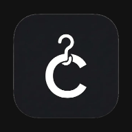
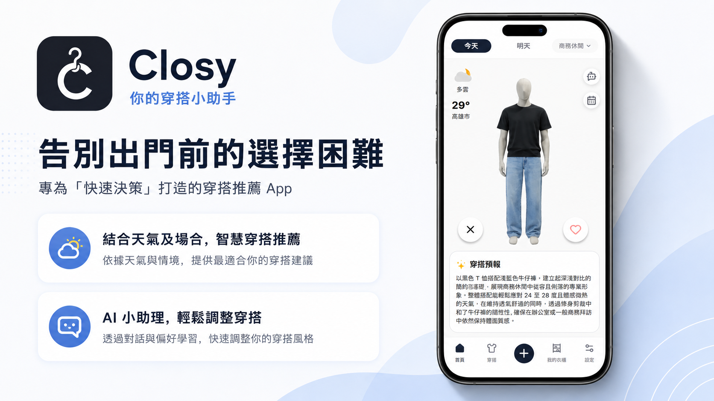
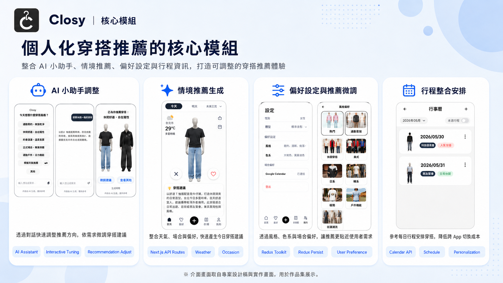
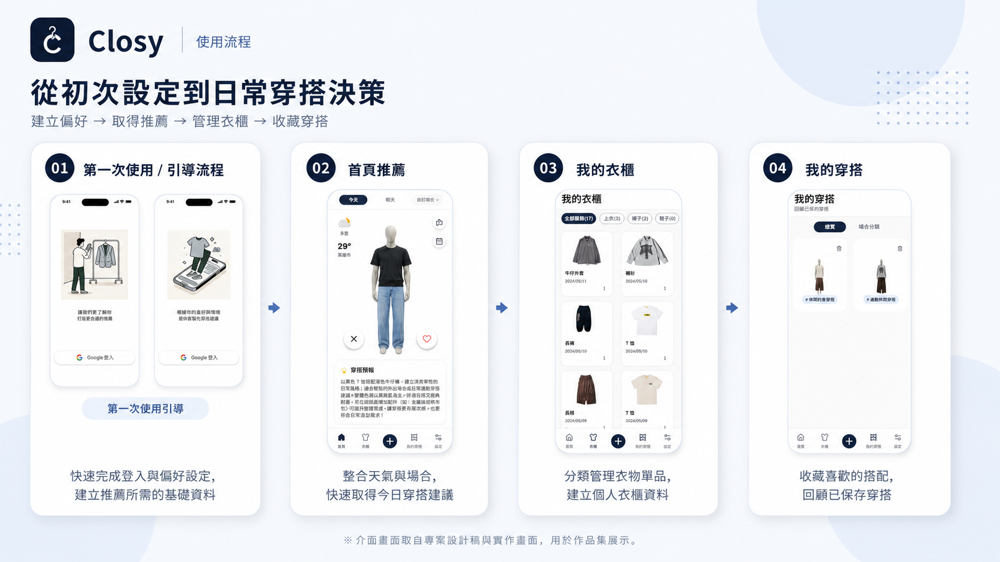

#  Closy | 我的穿搭小助手

[](https://nextjs.org/)
[](https://react.dev/)
[](https://www.typescriptlang.org/)
[](https://tailwindcss.com/)
[](https://redux-toolkit.js.org/)
[](https://web.dev/progressive-web-apps/)

> 👉 **[立即試用 Live Demo](https://closy-nine.vercel.app/)** — 建議使用手機開啟

## 🔗 相關資源 | Related Links

| 項目 | 連結 |
|------|------|
| 📊 產品簡報 | [Figma Slides →](https://www.figma.com/slides/z2rFIAmzYczFDECBEtkXFh/Closy-%E4%BD%A0%E7%9A%84%E7%A9%BF%E6%90%AD%E5%8A%A9%E6%89%8B?node-id=13-9&t=qHSllj7SsltkCo9i-0) |
| ✂️ 去背模型 | [rembg-service →](https://github.com/fntxxx/rembg-service) |
| 👗 辨識模型 | [fashion-attr-service →](https://github.com/fntxxx/fashion-attr-service) |
| ⚙️ 後端 Repo | [closy-api →](https://github.com/Danny-1211/closy-api) |

---

Closy 是一個以「快速完成每日穿搭決策」為核心的 mobile-first 穿搭推薦應用。

專案整合個人衣櫃、天氣資訊、場合需求、風格與色系偏好，並支援 Google Calendar 情境參考，協助使用者快速取得今日 / 明日穿搭建議，降低每天出門前搭配衣服的決策成本。

---

## 🏗 系統架構 | System Architecture

Closy 由四個獨立 repo 組成，各自負責不同的服務層：

| 服務 | Repo | 說明 |
|------|------|------|
| 前端 | closy（本 repo） | Next.js web app，mobile-first UI、BFF API Routes |
| 後端 | [closy-api](https://github.com/Danny-1211/closy-api) | 業務邏輯、資料存取、AI 穿搭推薦 |
| 去背模型 | [rembg-service](https://github.com/fntxxx/rembg-service) | 衣物圖片去背，部署於 HuggingFace |
| 辨識模型 | [fashion-attr-service](https://github.com/fntxxx/fashion-attr-service) | 衣物屬性辨識，部署於 HuggingFace |

```
使用者
  │
  ▼
前端 closy（Next.js）
  │  BFF API Routes
  ▼
後端 closy-api
  ├──▶ 去背模型 rembg-service
  └──▶ 辨識模型 fashion-attr-service
```

---

## 👀 專案預覽 | Project Preview



---

## 🛠 使用技術 | Technical Stack

### 前端 Frontend — [closy](https://github.com/Lin4611/closy) · 部署於 Vercel

| 類別 | 技術 |
|------|------|
| 核心框架 | Next.js 16.1.6、React 19.2.3 |
| 開發語言 | TypeScript |
| 樣式處理 | Tailwind CSS v4、tw-animate-css |
| 狀態管理 | Redux Toolkit、React Redux、Redux Persist |
| 身份驗證 | Google OAuth |
| PWA 支援 | @ducanh2912/next-pwa |
| UI / Interaction | Radix UI、Vaul、Sonner、Lucide React、Hugeicons |
| 工具函式 | clsx、tailwind-merge、class-variance-authority |
| 程式碼規範 | ESLint、Prettier、prettier-plugin-tailwindcss |

### 後端 Backend — [closy-api](https://github.com/Danny-1211/closy-api) · 部署於 Render

| 類別 | 技術 |
|------|------|
| 核心框架 | Node.js + Express 5.2.1、TypeScript |
| 資料庫 | MongoDB + Mongoose 9.3.0 |
| AI 整合 | Google Gemini |
| 媒體管理 | Cloudinary 2.9.0 |
| 身份驗證 | JWT |
| 圖片處理 | Sharp 0.34.5 |
| API 文件 | Swagger UI |

### AI 模型服務 AI Services · 部署於 Hugging Face Spaces

| 服務 | 技術 |
|------|------|
| [rembg-service](https://github.com/fntxxx/rembg-service)（去背） | Python + FastAPI + rembg |
| [fashion-attr-service](https://github.com/fntxxx/fashion-attr-service)（辨識） | Python + FastAPI + Marqo FashionSigLIP |

---

## 🚀 快速開始 | Quick Start

### 環境需求

- Node.js 18+
- npm

### 安裝與啟動

```bash
# 複製專案
git clone https://github.com/Lin4611/closy.git

# 安裝套件
npm install
```

建立 `.env.local` 並填入以下變數：

```env
API_BASE_URL=                    # Backend API 位址（伺服器端，BFF routes 使用）
NEXT_PUBLIC_API_BASE_URL=        # Backend API 位址（客戶端，SSE streaming 使用）
NEXT_PUBLIC_GOOGLE_CLIENT_ID=    # Google OAuth Client ID
NEXT_PUBLIC_SITE_URL=            # 部署網址（PWA 使用）
```

```bash
# 啟動開發伺服器
npm run dev
```

開啟 [http://localhost:3000](http://localhost:3000) 即可看到結果。

### 其他指令

```bash
npm run build        # 正式建置
npm run lint         # 執行 ESLint
npm run lint:fix     # ESLint 自動修正
npm run format       # Prettier 格式化
```

---

## ✨ 核心功能 | Features

| 功能 | 說明 |
|------|------|
| 🧭 初始引導 | 首次使用透過引導流程完成 Google 登入、性別 / 場合 / 位置偏好設定，以及初始衣物新增，建立個人化推薦基礎 |
| 🏠 每日穿搭推薦 | 首頁依據天氣與個人偏好推薦今日 / 明日穿搭，可標記喜歡 / 不喜歡、收藏穿搭，或進入 AI 調整流程 |
| 💬 AI 穿搭調整 | 以自然語言描述調整方向（保留特定單品、改變風格或單品類型等），AI 小助手重新生成更符合需求的穿搭建議 |
| 👚 我的衣櫃 | 管理個人衣物，新增時支援拍照或相簿選取，經 AI 自動辨識類別、顏色、場合等屬性後由使用者審核確認 |
| 🧥 我的穿搭 | 瀏覽所有收藏或曾產生的穿搭紀錄，可依場合分類查看穿搭詳情 |
| 📅 行事曆情境搭配 | 可選擇同步 Google Calendar 將行程帶入 App；不論是否同步，皆可在 App 內直接預排場合與穿搭，無需在兩個 App 之間切換 |
| ⚙️ 設定與偏好 | 管理預設場合、風格偏好與顏色偏好，調整後影響每日穿搭推薦結果 |
| 📱 PWA 支援 | 可安裝至主畫面，支援 Service Worker、離線 fallback 與圖片快取，使用體驗接近原生 App |



---

## 🚶 建議使用流程 | Recommended Flow

1. **Google 登入** — 使用 Google 帳號登入，依照引導完成性別、場合、位置偏好設定，並新增第一套衣物
2. **查看每日推薦** — 首頁依據天氣與偏好顯示今日 / 明日穿搭，按喜歡確認、按不喜歡換一套
3. **充實衣櫃** — 持續拍照或從相簿上傳衣物，AI 自動辨識屬性，讓推薦結果更貼近你的實際衣物
4. **排程行事曆** — 預先建立行程並設定場合（可選擇同步 Google Calendar），首頁當天自動依場合推薦
5. **切換場合** — 當天行程臨時有變，直接在首頁或設定切換場合，推薦穿搭即時更新
6. **AI 穿搭調整** — 對推薦不滿意，點選 AI 小助理輸入需求（例如「想加件外套」），重新生成更符合的穿搭



---

## 📂 專案架構 | Project Architecture

專案採用 Next.js Pages Router，並以 `src/modules` 管理各功能模組。  
`page` 層負責路由入口、頁面組裝與資料流協調；`modules` 負責各功能區塊的元件、型別與邏輯；`store` 負責跨頁狀態管理。

```text
closy/
├─ public/                         # 靜態資源、PWA manifest、favicon、離線頁資源
│
├─ src/
│  ├─ pages/                       # Next.js Pages Router 路由入口
│  │  ├─ api/                      # API Routes，作為前端與後端 API 的橋接
│  │  ├─ _app.tsx                  # App 初始化、Redux、Google OAuth、路由保護
│  │  ├─ _document.tsx             # Document 設定
│  │  └─ _offline.tsx              # PWA 離線 fallback 頁面
│  │
│  ├─ modules/                     # 功能模組
│  │  ├─ home/                     # 首頁、每日穿搭推薦、天氣卡片、穿搭互動
│  │  ├─ guide/                    # 初始引導、登入引導、偏好建立
│  │  ├─ wardrobe/                 # 我的衣櫃、衣物新增、衣物詳細、衣物編輯
│  │  ├─ outfit/                   # 我的穿搭、穿搭詳情、場合分類
│  │  ├─ settings/                 # 設定頁、預設場合、風格與顏色偏好
│  │  ├─ calendar/                 # 行事曆、行程情境搭配
│  │  └─ common/                   # 跨功能共用版型與 domain 元件
│  │
│  ├─ components/
│  │  └─ ui/                       # shadcn/ui 基礎元件與客製 UI 元件
│  │
│  ├─ store/                       # Redux Toolkit 狀態管理
│  │  ├─ slices/                   # userSlice、homeSlice、outfitSlice
│  │  ├─ hooks.ts                  # useAppDispatch、useAppSelector
│  │  └─ index.ts                  # store 與 redux-persist 設定
│  │
│  ├─ lib/
│  │  ├─ api/                      # API client、型別定義、domain 共用 API 邏輯
│  │  ├─ utils.ts
│  │  ├─ date.ts
│  │  ├─ weather.ts
│  │  └─ font.ts
│  └─ styles/                      # globals.css 與全域樣式
│
├─ next.config.ts                  # Next.js、Image remote patterns、PWA 設定
├─ tsconfig.json                   # TypeScript 設定與 @/* alias
├─ eslint.config.mjs               # ESLint 設定
├─ package.json                    # 專案依賴與 scripts
└─ README.md                       # 專案說明文件
```

---

## 👥 團隊成員 | Team

| 成員 | 角色 | 負責範疇 |
|------|------|----------|
| [Lin](https://github.com/Lin4611) | 前端開發 | 前端架構、頁面開發、BFF API Routes |
| [尚倫](https://github.com/fntxxx) | 前端開發 | 前端頁面開發、去背模型、辨識模型 |
| [Danny](https://github.com/Danny-1211) | 後端開發 | API 設計、資料庫、AI 穿搭推薦整合 |
| [Miya](https://www.figma.com/design/sTbk98QlMNUX2IrhuqyxXL/%E8%A1%A3%E6%AB%83%E7%AE%A1%E7%90%86-wireframe--%E6%96%B0-?node-id=849-7465&t=qqYGXNmIfcNIlrtz-1) | UI / UX 設計 | 視覺設計、Wireframe、設計稿 |
